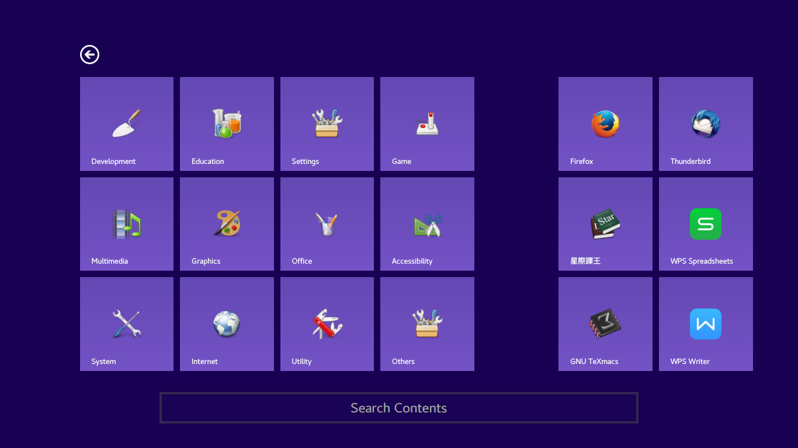
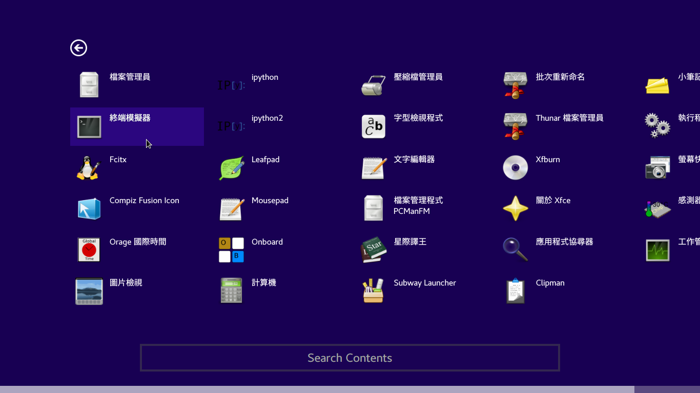
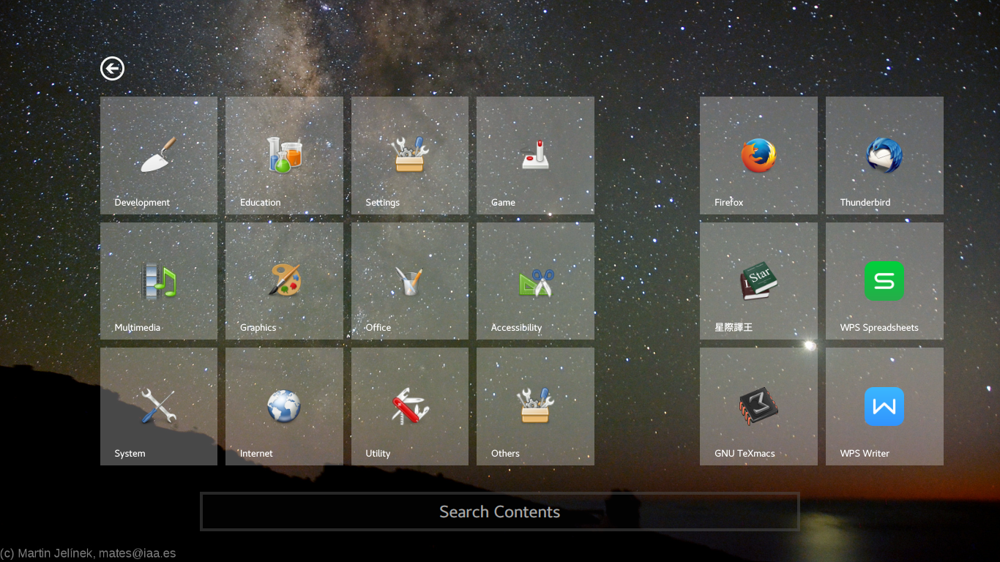
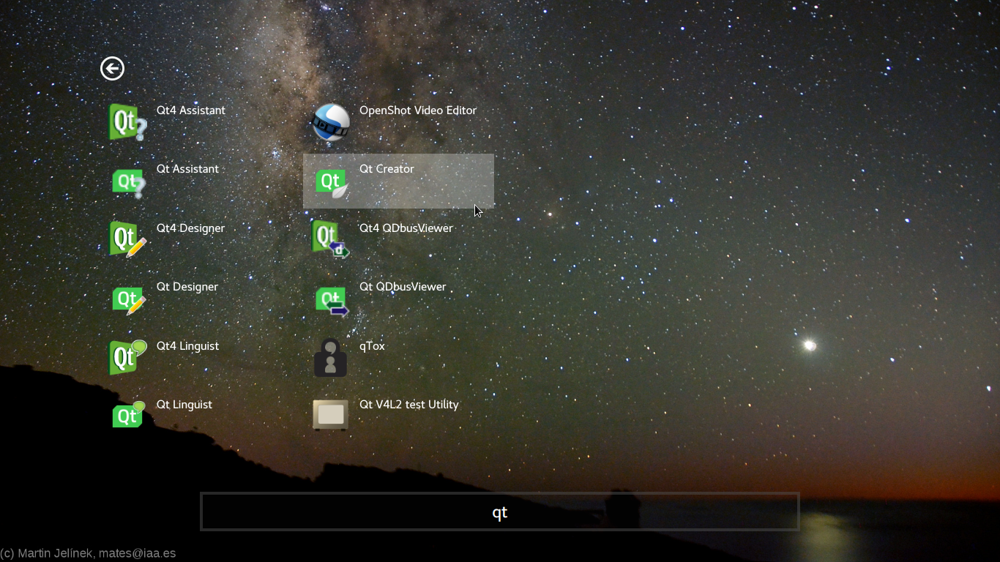

# Subway Launcher

An HTML5-based application launcher for GNU/Linux with MS-modern-like style.

It's just an experimental program which has been obsoleted. But it works, at least.

## Overview

### Default Style





### Custom Style





## Installation

### For Archlinux users

This program has a well-packed version in AUR:

```
$ yaourt -S subway-launcher-git
```

### For non-Arch users

There's no installation scripts now. It is required to create directories manually.
If you are just debugging, it is recommended to use the debug code below and test it without installation.
Because we haven't designed the directory structure standard for our WebApps, in order not to break the FHS, it is recommended to install it to `/opt`

### Dependencies

(Cubway)
`qt5` `libqtxdg`


### Debug
```
$ git clone https://github.com/Icenowy/Cubway
$ git clone https://github.com/SubwayDesktop/simple.js
$ git clone https://github.com/SubwayDesktop/subway-launcher
$ cd Cubway
$ wget https://cirno.xyz/~jqk/files/Babel.tar.gz
$ tar -vxaf Babel.tar.gz
$ rm Babel.tar.gz
$ cmake .
$ make
$ cd Modules/Xdg
$ cmake .
$ make
$ cd ../../..
$ Cubway/cubway subway-launcher/main.html   # run it!
```

### Install

#### Install Cubway
```
$ git clone https://github.com/Icenowy/Cubway
$ cd Cubway
$ cmake .
$ make
$ cd Modules/Xdg
$ cmake .
$ make
$ cd ../..
# mkdir -p /opt/Subway/Cubway/Modules/Xdg
# cp cubway /opt/Subway/Cubway/
# cp Modules/Xdg/libXdg.so /opt/Subway/Cubway/Modules/Xdg/
```
#### Install Babel
```
# cd /opt/Subway/Cubway/
# wget https://cirno.xyz/~jqk/files/Babel.tar.gz
# tar -vxaf Babel.tar.gz
# rm Babel.tar.gz
```
#### Install Simple.js
```
$ git clone https://github.com/SubwayDesktop/simple.js
# mkdir /opt/Subway/simple.js
# cp simple.js/simple.js /opt/Subway/simple.js/
```
#### Install Subway Launcher
```
$ git clone https://github.com/SubwayDesktop/subway-launcher
$ cd subway-launcher
# mkdir /opt/Subway/launcher
# cp * /opt/Subway/launcher
```

#### Run it

```
$ /opt/Subway/Cubway/cubway /opt/Subway/launcher/main.html
```

## Return to foreground

When you run an app in the launcher or press the "go back" button, the launcher will hide into backgroud. Use the following commands to put it back to foreground.

```
#!/bin/sh

dbus-send --session --dest=org.subwaydesktop.launcher --type=method_call /view org.subwaydesktop.cubway.toggleVisible

dbus-send --session --dest=org.subwaydesktop.launcher --type=method_call /view org.subwaydesktop.cubway.activateWindow
```

## Desktop Icons

Create symbolic links to `.desktop` files from `/usr/share/applications` in your desktop folder and the icons will be shown in the right side of the launcher.

## Update App List

When you install new applications, sadly, the launcher will not update the app list immediately. Right click in the launcher and select "Reload" in the context menu.

## Custom Style

To change the style of the launcher, create `/home/jqk/.config/subway/launcher/user_style.css` and write your style into it.

As for rules, you can refer to `style.css` and `main.html`. You can also right click on the launcher and select "Inspect" in the context menu to try some rules.

### Example

#### Background Image

```
body {
    background-attachment: fixed;
    background-repeat: no-repeat;
    background-size: cover;
    background-image: url("/home/jqk/Pictures/Wallpapers/venus.jpg");
}
```

#### Tile Color

```
.tile {
    background: hsla(0, 0%, 95%, 0.3);
}


#go_back_button:hover, .entry_tile:hover {
    background: hsla(0, 0%, 95%, 0.3);
}
```

#### Scrollbar Track Color

```
::-webkit-scrollbar, ::-webkit-scrollbar-track, ::-webkit-scrollbar-track-piece {
    background: hsl(0, 0%, 30%);
}
```
